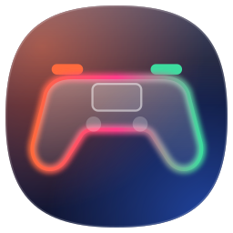
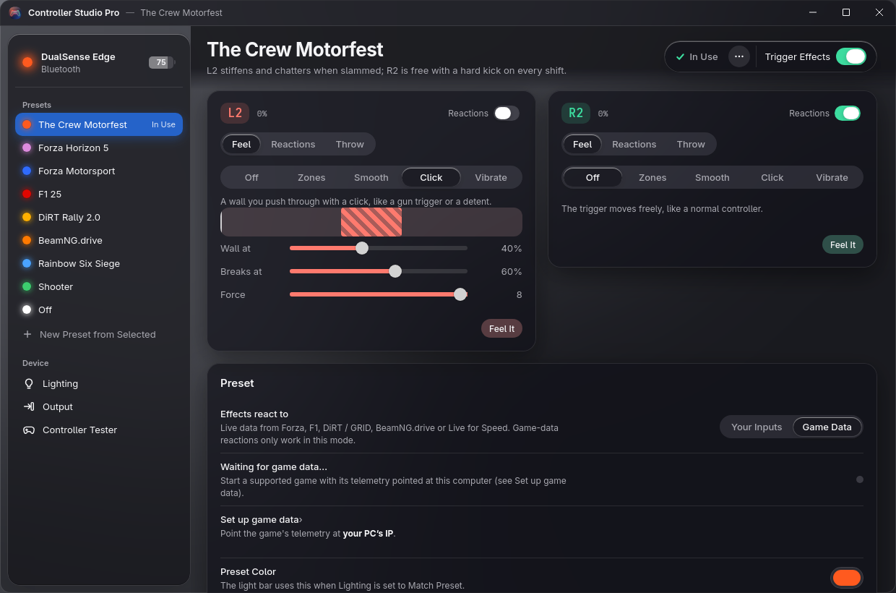
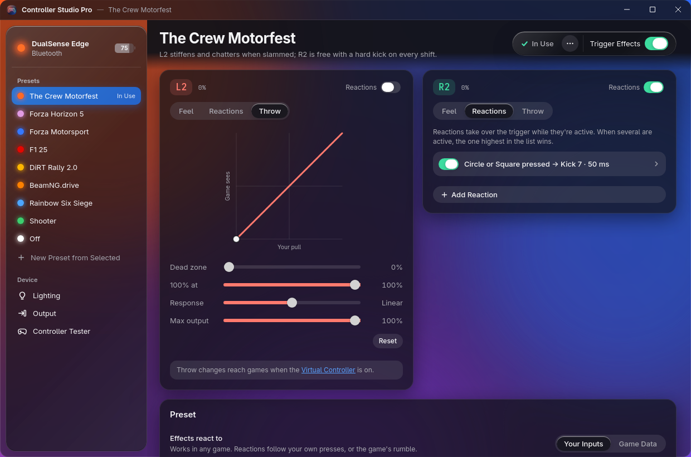
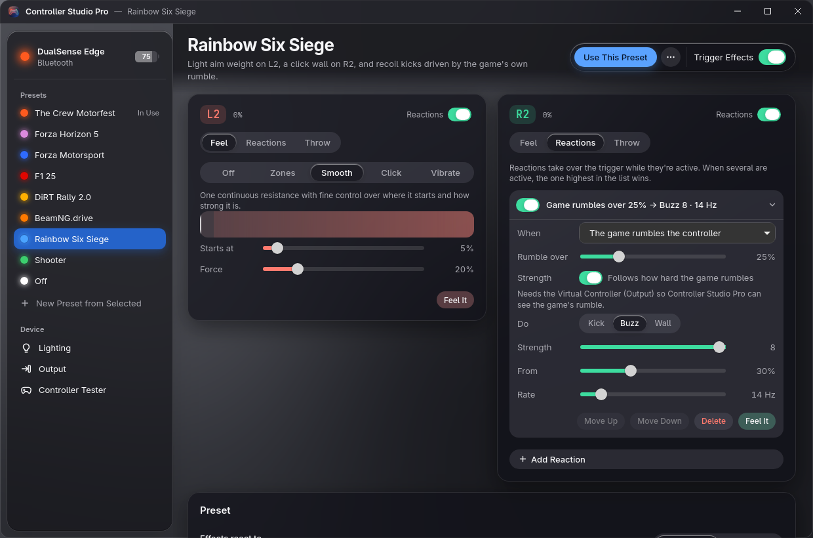
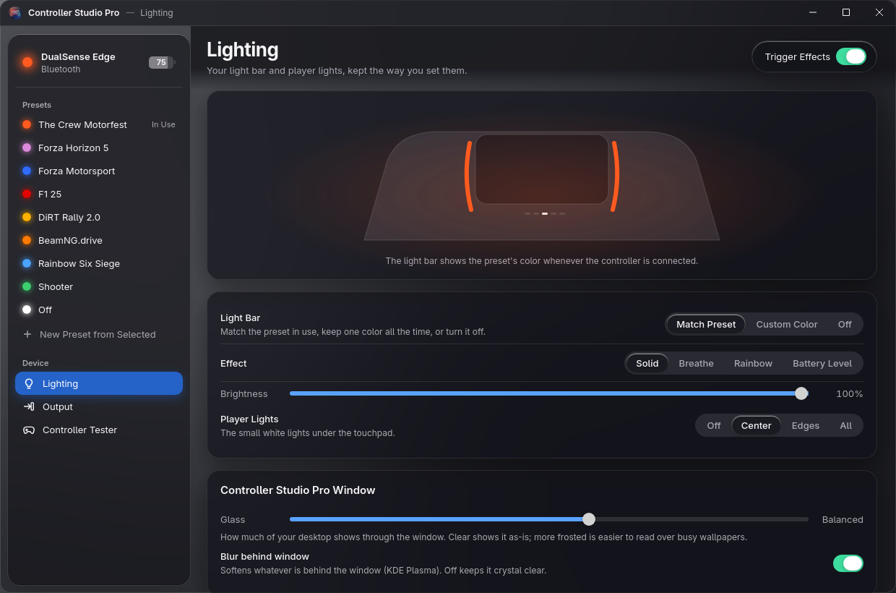
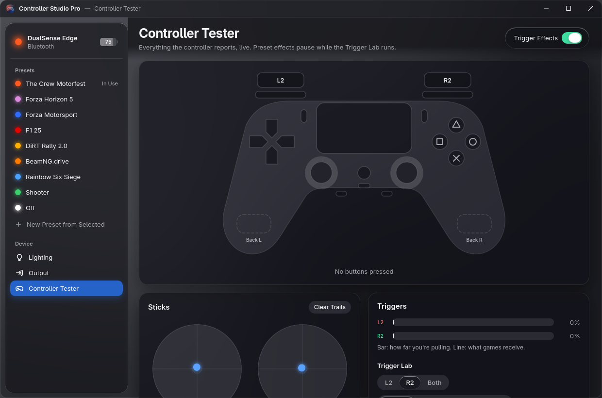
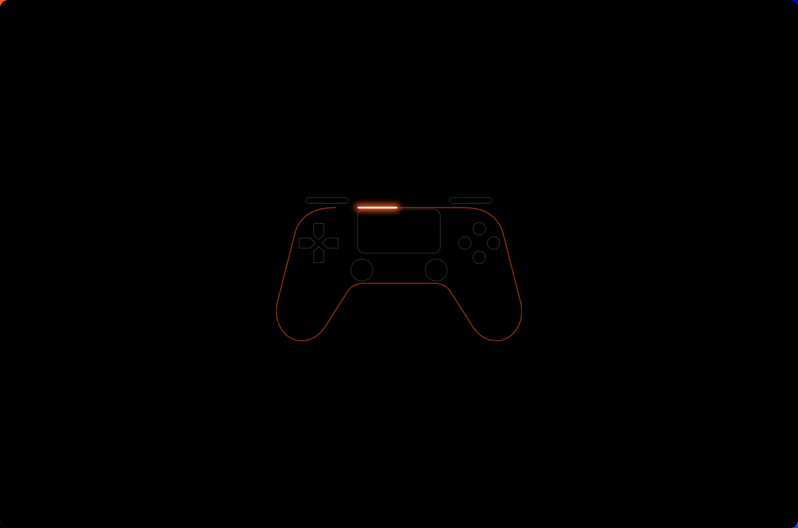

<p align="center"></p>

# Controller Studio Pro

Adaptive triggers, lighting and a full controller tester for the **PlayStation DualSense** and **DualSense Edge** on Linux and Windows. It drives the controller directly, so the effects work everywhere, including streaming with Moonlight, where the PC never sees a real DualSense.



## Install

### Windows 10 / 11

Controller Studio Pro for Windows is a native app (`ControllerStudioPro.exe`, built with WPF and the Windows 11 look). It doesn't need Python, a browser engine or a background web server.

Open **PowerShell** (no admin needed) and run:

```powershell
irm https://raw.githubusercontent.com/nomad9021/Controller-Stuidio-Pro/main/install.ps1 | iex
```

The installer:
- installs the **ViGEmBus** driver for the virtual controller (Windows asks for permission once),
- puts `ControllerStudioPro.exe` in `%LOCALAPPDATA%\ControllerStudioPro` and adds it to the Start menu,
- starts it at sign-in, quietly in the notification area,
- removes the old Python version if it finds one. Your presets carry over.

You can also download `ControllerStudioPro.exe` from [Releases](https://github.com/nomad9021/Controller-Stuidio-Pro/releases/latest) and run it directly.

Closing the window keeps the app running from the notification area, so trigger effects and lighting stay on. Use the tray icon to switch presets, toggle effects, or quit. You can turn this off on the **Output** page, along with starting with Windows.

Run the same command again to update. To uninstall:

```powershell
& ([scriptblock]::Create((irm https://raw.githubusercontent.com/nomad9021/Controller-Stuidio-Pro/main/install.ps1))) -Uninstall
```

Differences on Windows:
- The window uses the Windows 11 look (Mica, light/dark, your accent color) instead of the see-through glass.
- With the virtual controller on, games can see both it and the real DualSense. If a game reacts twice, hide the real one with [HidHide](https://github.com/nefarius/HidHide). Turning the virtual controller on also sets the SDL variables that make Moonlight ignore the real controller.
- The first time it runs, Windows Firewall asks about network access. That's the game-data listener (UDP 5300, 20777 and 4444). Allow it on private networks if a game on another PC sends telemetry; games on the same PC work either way.

The Windows source is in [`windows/`](windows/). `ControllerStudio.Core` is the engine, tested byte-for-byte against the Python version. `ControllerStudioPro` is the app. To build it, run `dotnet publish windows/src/ControllerStudioPro -c Release`.

### Linux

```bash
curl -fsSL https://raw.githubusercontent.com/nomad9021/Controller-Stuidio-Pro/main/install.sh | bash
```

The installer:
- installs the dependencies (Python GTK and WebKitGTK),
- puts the app in `~/.local/share/controller-studio-pro`,
- adds two udev rules so your user can talk to the controller (it asks for your password once),
- starts the background service,
- adds **Controller Studio Pro** to your app menu.

Run the same command again to update.

To uninstall:

```bash
curl -fsSL https://raw.githubusercontent.com/nomad9021/Controller-Stuidio-Pro/main/install.sh | bash -s -- --uninstall
```

Supports Fedora, Debian/Ubuntu, Arch and openSUSE. Connect the controller over Bluetooth or USB first. If it was already connected when you installed, turn it off and on.

## Features

**Per-game presets.** The built-in presets are The Crew Motorfest, Forza Horizon 5, Forza Motorsport, F1 25, DiRT Rally 2.0, BeamNG.drive, Rainbow Six Siege, Shooter and Off. You can edit any of them or copy one to make your own.

**Each trigger (L2 / R2) has three tabs:**
- **Feel:** the trigger's resting resistance.
  - *Zones:* ten draggable zones, each 0–8.
  - *Smooth:* continuous resistance with 1% control over where it starts and how strong it is.
  - *Click:* a wall that breaks with a click.
  - *Vibrate:* a constant vibration from a set point in the pull.
- **Reactions:** rules that take over the trigger while active. They can fire when buttons are pressed (back paddles included), when the trigger is slammed, when it's held past a point, when **the game rumbles the controller**, or on live game data (gear change, wheel lock, wheelspin, redline). The effect can be a kick, buzz or wall, with strength, position, rate and length. A switch on each card turns all of that trigger's reactions on or off.
- **Throw:** dead zone, the point where it reaches 100%, response curve and maximum output, with a live graph of what the game receives. Needs the virtual controller.



**Game data.** Games that send live telemetry drive the reactions from the actual car: real ABS lock-up, gear changes (automatic too), wheelspin and the rev limiter. Point the game's telemetry at this machine:

| Game | Where | Port |
| --- | --- | --- |
| Forza Horizon 4 / 5, Forza Motorsport 7 / 2023 | Settings › HUD and Gameplay › Data Out | 5300 |
| F1 22 / 23 / 24 / 25 | Settings › Telemetry Settings › UDP Telemetry | 20777 |
| DiRT Rally 2.0, DiRT 4, GRID | `hardware_settings_config.xml`: `<udp enabled="true" extradata="3" ip="…" port="20777" delay="1" />` | 20777 |
| BeamNG.drive | Options › Other › OutGauge | 4444 |
| Live for Speed | `cfg.txt`: `OutGauge Mode 1`, `OutGauge IP …`, `OutGauge Port 4444` | 4444 |

**Every other game (The Crew Motorfest, Rainbow Six Siege, …).** Most games don't share live data, and reading their memory would trip anti-cheat. Instead, a **Game rumble** reaction fires whenever the game shakes the controller, for example gunfire in R6 or impacts and lock-ups in Motorfest. It can scale its strength with how hard the game rumbles. It needs the virtual controller (Output) so the app can see the rumble.



**Lighting.** Match the preset's colour, keep one colour all the time, or turn the light bar off. Effects are solid, breathe, rainbow and battery level, with brightness control and the player lights.



**Output (virtual controller).** Games get a remapped copy of the controller, so Throw settings apply and the Edge's back paddles and Fn buttons can act as any button. Games see it as an Xbox-style pad, and rumble from games is passed back to the DualSense. Turning it on also sets up Flatpak Moonlight to ignore the real controller; restart Moonlight afterwards.

**Controller Tester.** Shows every button live, including the Edge paddles and Fn buttons. It draws the sticks' range with a drift readout and shows trigger travel next to what games receive. It also covers the touchpad, motion (tilt, gyro, accelerometer), battery, report rate, rumble motors, and a Trigger Lab for trying each effect by hand.



**Shortcuts.** Hold **L3 + R3** for one second on the controller to turn trigger effects on or off mid-game.

## The app

The window is see-through glass with a soft glow in your light bar colour. On KDE Plasma, KWin blurs the desktop behind it. It has a Windows-style title bar: drag it, double-click to maximize, and use the minimize/maximize/close buttons. You set how frosted it looks under Lighting → Controller Studio Pro Window. It follows the system light/dark theme, and the boot animation traces the controller outline in your light bar colour.



## How it works

- `controllerstudio/engine.py` reads the controller's raw HID reports and sends trigger, lighting and player-LED output reports over Bluetooth or USB. It also runs the reactions.
- `controllerstudio/telemetry.py` parses game telemetry (Forza, F1, Codemasters, OutGauge).
- `controllerstudio/virtualpad.py` creates the remapped virtual controller through `/dev/uinput` and forwards rumble.
- On Windows, the native app in `windows/` replaces all of this. `Engine.cs` is a port of `engine.py`, using HidSharp for the controller and ViGEmBus for the virtual Xbox controller. The older Python modules for Windows (`winhid.py`, `winpad.py`, `winwindow.py`) are no longer installed.
- `controllerstudio/server.py` is a small local service on `127.0.0.1:8765` that runs the engine and serves the UI. It runs as the systemd user service `controller-studio-pro`.
- `controller-studio-pro` is the GTK + WebKitGTK window.

Settings and presets live in `~/.config/controller-studio-pro/presets.json` (`%APPDATA%\controller-studio-pro\presets.json` on Windows).

## Troubleshooting

- **"Controller not connected"**: press the PS button. Check that it's paired in your Bluetooth settings.
- **No trigger effects**: make sure the udev rules are installed (`ls /etc/udev/rules.d/ | grep -i -e dualsense -e controller-studio`), then reconnect the controller.
- **Service logs**: `journalctl --user -u controller-studio-pro -f`
- **Windows, something's wrong**: check `%LOCALAPPDATA%\ControllerStudioPro\error.log` (app errors) and `engine.log` (controller connection problems).
- **Windows, the controller isn't found over Bluetooth**: remove it in Bluetooth settings and pair it again.
